# VitaShop

An e-commerce store for vitamins and dietary supplements, built as a coursework project for **Digital Systems Planning and Development**, Ramat Gan Academic College.


---

## Project documentation

The functional requirements, the decision log, and the session-by-session
status live in a private Markdown knowledge base the author maintains
alongside the code — which is why commit messages cite identifiers like
`DEC-107` (a recorded decision) and `ISSUE-124` (a tracked issue). Keeping
that process documentation external keeps the repository focused on what a
reviewer needs: the code, the data, and how to run it. The course
deliverable that summarises the system is the submission document.

---

## Status

**Fully implemented and running locally, end to end.**

```
✅  Catalogue — 50 real products, 8 brands, search/filter/sort/paging, all server-side
✅  Cart, checkout, orders — guest + registered, atomic stock, simulated payment, cancellation window
✅  Auth — email verification, lockout, password reset, Argon2id hashing
✅  Personal area — history, reorder, profile, address book, favourites, customer club
✅  Admin module — products, inventory, orders, analytics dashboard (KPIs, funnel, low stock)
✅  AI shopping assistant — catalogue-only, medical-safety rules, mock provider by default
✅  Bilingual Hebrew/English with full RTL/LTR
✅  2,190+ automated tests (server + client), mutation-tested guarantees
⬜  Cloud deployment — the planned next step
```

---

## Tech stack

```
Client    React 18 · Vite · TypeScript · Tailwind CSS · React Router
Server    Express · TypeScript · Prisma
Database  PostgreSQL
```

**Why client and server are separate projects rather than a unified framework:** the specification defines three layers communicating by request/response, with the server as the sole source of truth for prices, stock and permissions. Physical separation makes that property demonstrable rather than merely claimed, and keeps the API surface small enough to audit.

---

## Repository structure

```
VitaShop/
├── README.md              you are here
├── SETUP.md               reviewer walkthrough: clone → running store
├── package.json           root convenience scripts (setup / db / seed / dev / test)
├── CLAUDE.md              instructions for Claude Code
├── AGENTS.md              instructions for Codex
├── CODEX.md               pointer to AGENTS.md
├── assets/
│   ├── brand/             logo artwork — source/ originals, web/ derived exports
│   ├── products/          product images + seed data
│   │   ├── products.csv       one row per product — the catalogue's source of truth
│   │   ├── ingredients.csv    one row per active ingredient
│   │   └── REFERENCE.md       allowed values and fill order
│   └── ui/                icons, backgrounds
├── scripts/               asset-derivation and data-check scripts (Python)
├── client/                React frontend (Vite + TypeScript + Tailwind)
└── server/                Express backend (TypeScript + Prisma + PostgreSQL)
```

### Product data

`assets/products/products.csv` is the single source of truth for the catalogue. The seed script reads it; nothing else defines what products exist.

🔴 **Two tiers of field, with different rules:**

| Tier | Fields | Rule |
|---|---|---|
| Invent freely | price · stock · description · health goals | A demo store. Accuracy is irrelevant |
| **Must be accurate** | active ingredients · warnings and allergens · usage instructions · package quantity | These describe **real products**. A wrong allergen is a safety problem, not a cosmetic one |

The catalogue uses photographs of real branded products for academic purposes. A made-up price reads as obviously fictional; a made-up allergen list does not. See `assets/products/REFERENCE.md`.

---

## Agent instructions

Three files at the repository root, loaded automatically by filename:

| File | Loaded by | Purpose |
|---|---|---|
| `CLAUDE.md` | Claude Code | Lead developer — builds features, writes code and tests |
| `AGENTS.md` | Codex | Reviewer and second developer |
| `CODEX.md` | nobody | A pointer, so the name is not searched for in vain |

**Codex runs in one of two modes, selected explicitly by the user:**

- **REVIEW** (default) — finds and fixes bugs and security problems. Adds nothing.
- **BUILD** (on request) — continues the work plan as lead developer, bound by the same rules as Claude.

The second mode exists so development can continue when one agent's budget runs out, without the knowledge base losing coherence.

---

## Screenshots

The Hebrew (RTL) interface; every screen also ships in English (LTR).

### The shop

<p align="center">
  
  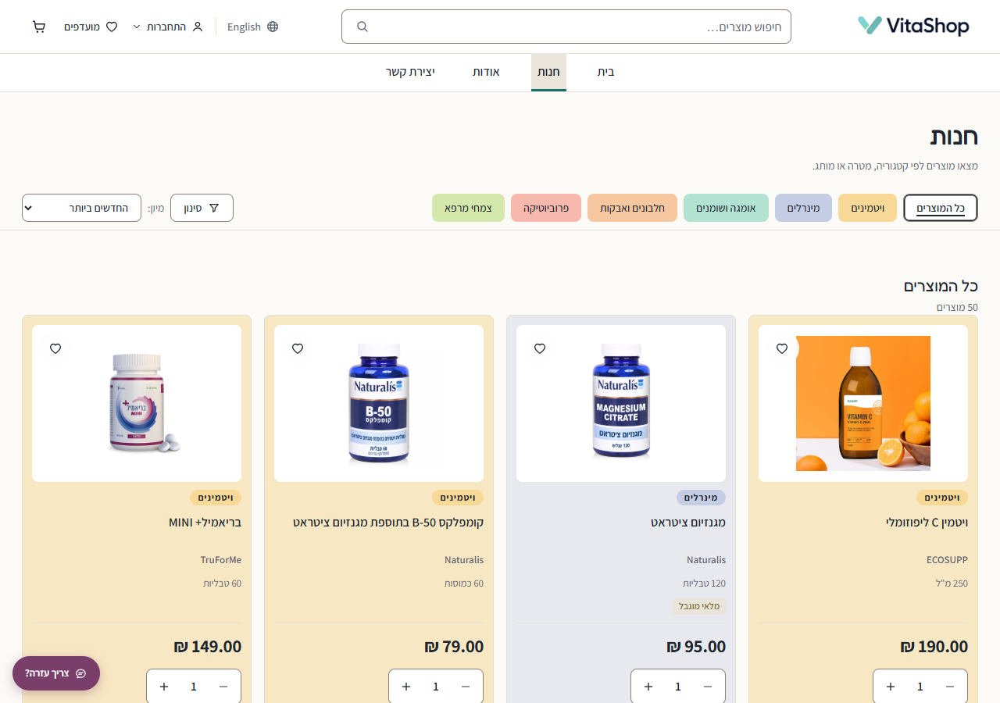
</p>
<p align="center"><sub><b>Home</b> — categories, health goals, new arrivals&emsp;·&emsp;<b>Catalog</b> — server-side search, filters, sorting, paging</sub></p>

<p align="center">
  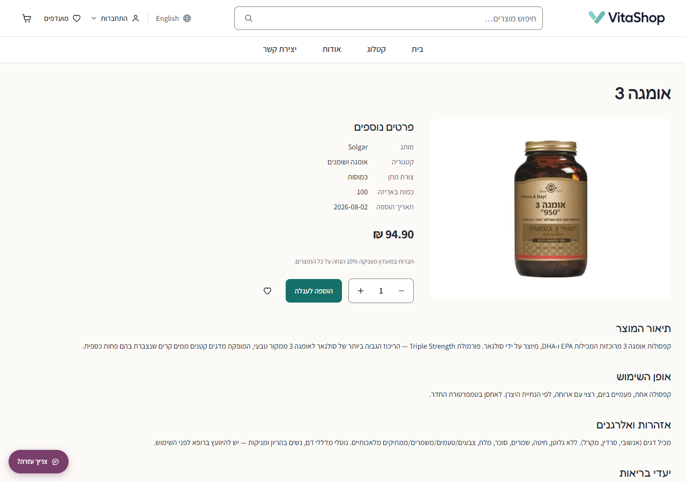
  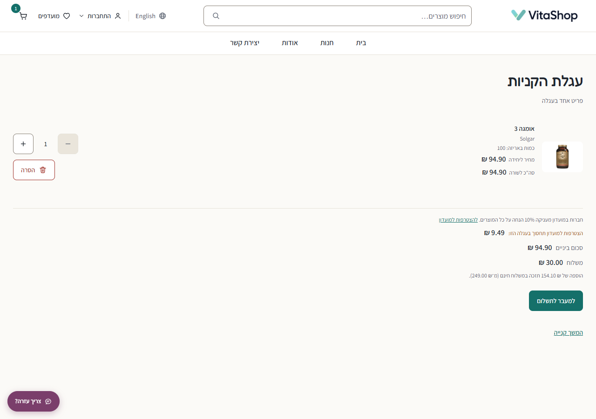
</p>
<p align="center"><sub><b>Product page</b> — brand, ingredients, warnings, club pricing&emsp;·&emsp;<b>Cart</b> — live stock checks, server-side totals</sub></p>

<p align="center">
  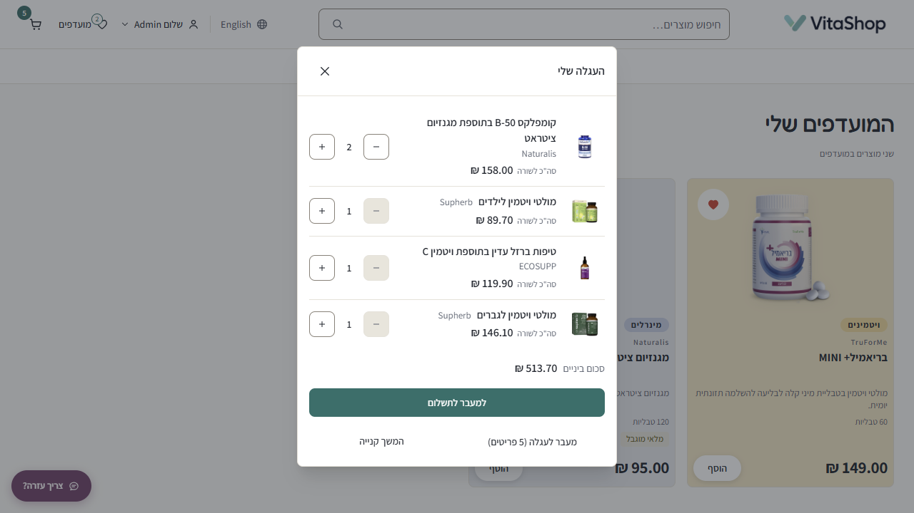
  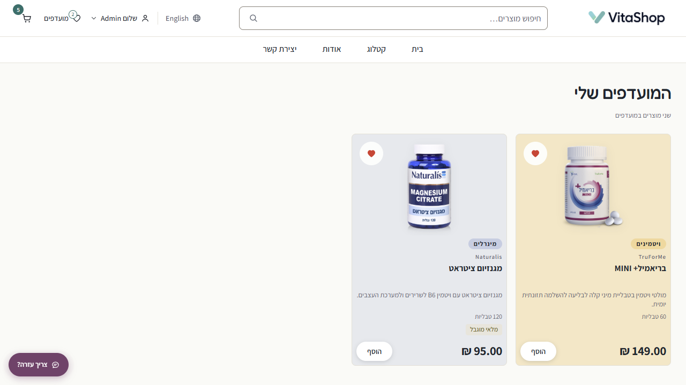
</p>
<p align="center"><sub><b>Cart drawer</b> — quick "keep shopping" glance after every add&emsp;·&emsp;<b>Favourites</b> — card-sized grid, count line, one-tap add</sub></p>

### Checkout

<p align="center">
  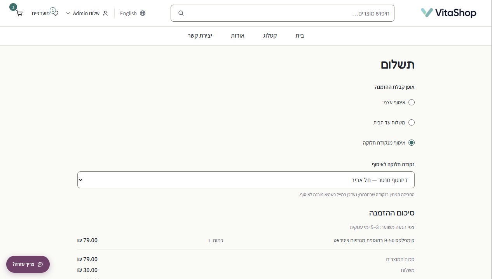
  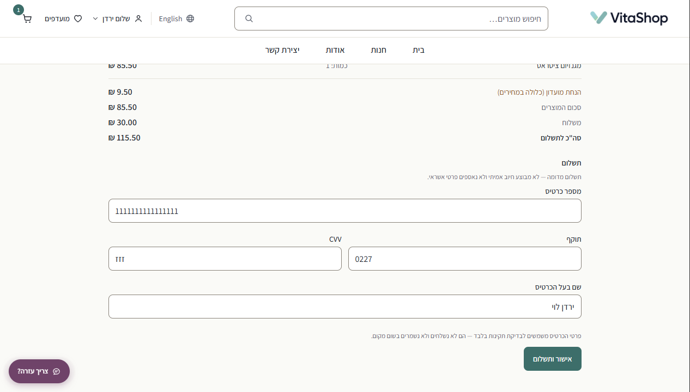
</p>
<p align="center"><sub><b>Delivery</b> — pickup, home delivery, or a pickup point&emsp;·&emsp;<b>Payment (simulated)</b> — the card form validates client-side only; details are never transmitted or stored</sub></p>

### Accounts and AI

<p align="center">
  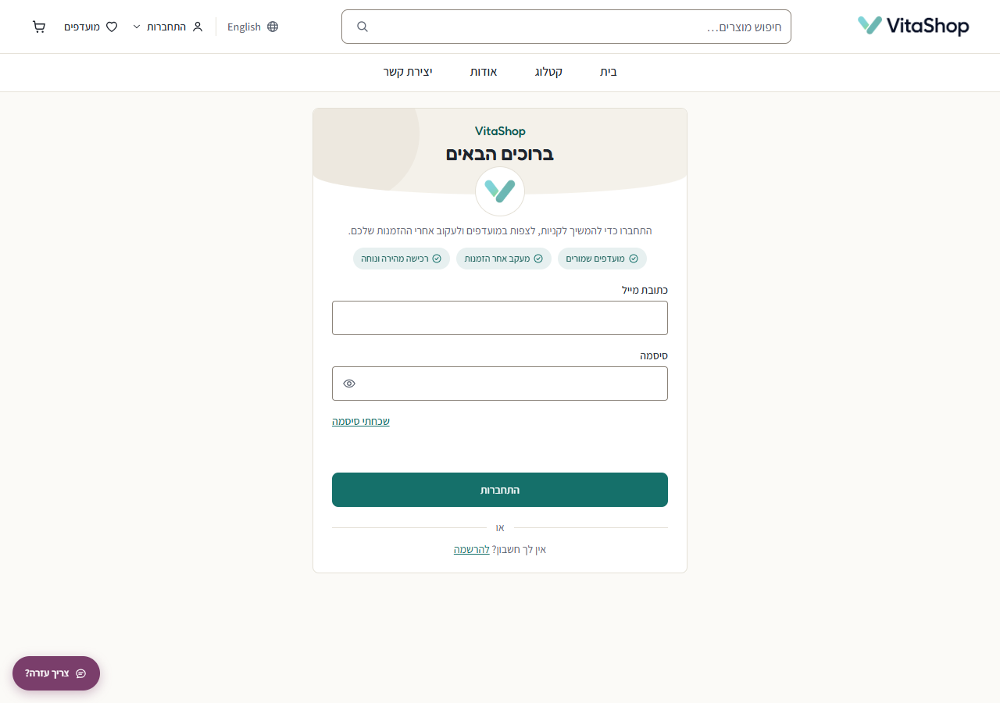
  
</p>
<p align="center"><sub><b>Log in</b>&emsp;·&emsp;<b>Sign up</b> — live password checklist, club opt-in</sub></p>

<p align="center">
  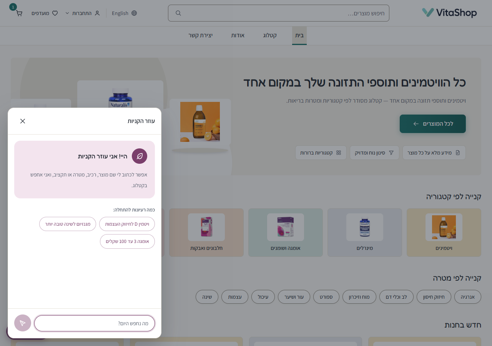
</p>
<p align="center"><sub><b>AI shopping assistant</b> — free-language search over the catalogue, with medical-safety rules</sub></p>

### Admin

<p align="center">
  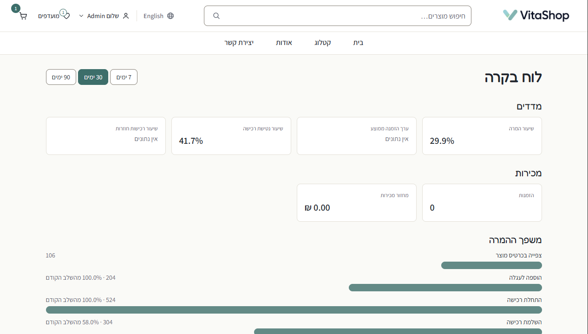
  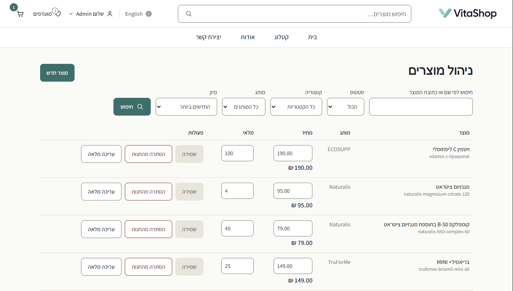
</p>
<p align="center"><sub><b>Dashboard</b> — KPIs, conversion funnel, low-stock alerts&emsp;·&emsp;<b>Product management</b> — inline editing, filters, soft-delete</sub></p>

---

## 🔴 Security

This project handles authentication, pricing and stock. A few rules are non-negotiable and are enforced in review:

- **All price calculation, stock checking and permission verification happen server-side.** The client is never a source of truth
- **No secrets in the repository.** API keys, database passwords and session secrets live only in `.env`, which is git-ignored
- **No agent obtains or configures an API key.** The AI provider defaults to a mock implementation; switching to a real provider requires an explicit human decision each time
- **Payment is simulated.** The card form validates format client-side only (Luhn, expiry, CVV); card details are never transmitted to the server and never stored

These rules are enforced where they matter — in the server code and its test suite (rate limiting in `server/src/lib/rateLimit.ts`, session/auth flows in `server/src/routes/auth.ts`, admin checks per-request in the route guards) — not merely documented.

⚠️ **A key committed to a remote repository is compromised on arrival** — automated scanners crawl public commits, and git history retains the value after the file is deleted. Revocation is the fix; rewriting history is not.

---

## Maintenance agent

**Dependabot** (`.github/dependabot.yml`) watches the three npm roots — workspace, `client/`, `server/` — and opens pull requests for outdated and vulnerable dependencies (minor/patch bumps grouped weekly per root; majors and security advisories arrive individually). Nothing it proposes lands on its own: `CODEOWNERS` routes every PR to the project author, and branch protection requires that review. This is the mechanism the specification describes in §4.11 — an agent proposes, a human approves, no agent holds write access.

---

## Getting started

**The system is fully implemented and runs locally end to end.**
The complete walkthrough — PostgreSQL install options, environment files,
seeding, login accounts, tests — is in **[SETUP.md](SETUP.md)**.

The short version, from the repo root:

```bash
npm run setup        # install server + client dependencies
# create a local vitashop_dev database, fill in the two .env files (see SETUP.md)
npm run db           # prisma migrations
npm run seed         # full catalogue (in-repo data + images) + your accounts
npm run dev:server   # http://localhost:3000
npm run dev:client   # http://localhost:5173  (second terminal)
```

Prerequisites: Node.js 24 and a local PostgreSQL instance (install options in SETUP.md). Every environment variable is documented in `server/.env.example` and `client/.env.example`.

**Admin access for reviewers.** There are no default passwords anywhere in the repo. The admin account is created by `npm run seed` from the email and password *you* put in `server/.env` (`SEED_ADMIN_EMAIL`, `SEED_ADMIN_PASSWORD` — the seeder refuses to run without them). Log in with that pair and the admin menu (products, orders, dashboard) appears. A second `SEED_SHOPPER_*` pair gives you an ordinary customer account for the shopping flow.

---

## Scope

**Simulated, by design:**

- **Payment** — the specification defines a simulation with no real charge
- **Email delivery** — the verification and reset logic is fully implemented (single-use tokens, 24-hour expiry, orders blocked until verified); only the transport prints to the console instead of sending

**Deliberately out of scope:** real payment processing, product reviews, loyalty programmes, multi-warehouse inventory, VAT and invoicing, personalised nutritional advice.

**Runs locally today.** Cloud deployment is the planned next step; the code is written deployment-ready — environment variables throughout, no hardcoded paths, no secrets.

---

## AI assistant

The site includes a conversational agent that helps users find products **within the catalogue**. It translates free-language requests into the same filter criteria the regular search uses.

🔴 **It does not diagnose, does not set dosages, and does not advise changing medical treatment.** When a user mentions pregnancy, medication, a medical condition, or a concern about interactions, a fixed notice directs them to a physician or pharmacist. Products are retrieved from the database, never generated by the model.

These rules are **implemented in the server**, not just written down: the medical-stop triggers, the fixed referral notice, and the redaction of medical terms before any external call live in `server/src/lib/ai/` and are covered by the test suite. A clone gets the full safety behavior with no extra configuration.

---

## Disclaimer

An academic project. Not a real store — no orders are fulfilled and no payments are processed. Product information is presented for demonstration and **must not be relied on for health decisions**. Consult a physician or pharmacist before taking any supplement.

---

Last updated: 2026-08-26
